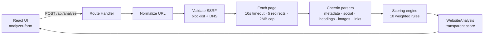

<div align="center">

# 🔍 MetaLens

**A website metadata & SEO analyzer built with Next.js 16, React 19 and TypeScript.**

Paste any public URL and get a **transparent, explainable breakdown** of its metadata, SEO signals, accessibility basics, and technical health — with a weighted score out of 100.

[](https://nextjs.org/)
[](https://react.dev/)
[](https://www.typescriptlang.org/)
[](https://tailwindcss.com/)
[](https://vitest.dev/)
[](./LICENSE)

</div>

> ⚠️ **Transparency first:** the score is an **estimated, documented heuristic** — it is **not** the official Google ranking score. Every point is explained, never a black box.

---

## ✨ Why this project

MetaLens was built as a **portfolio-grade engineering exercise** that goes beyond a simple "fetch and parse" demo. It demonstrates production concerns that matter in real systems:

- 🛡️ **Security by design** — a full **SSRF (Server-Side Request Forgery) defense layer**, including private-IP blocklists, cloud-metadata endpoint blocking, and **DNS re-validation on every redirect hop** to prevent DNS-rebinding attacks.
- 🧱 **Clean architecture** — strict separation between domain types, validation schemas, pure parsers, a pure scoring engine, and the HTTP boundary (Route Handler).
- 🧪 **Testability** — the scoring engine and parsers are **pure functions** with 41 unit tests, so the core logic is fully verifiable without a browser.
- ⚡ **Serverless-ready** — the entire analysis runs in a single Route Handler with **no filesystem, no WebSockets, no cron, and no global state**, so it deploys to Vercel as-is.
- 🎨 **Modern DX** — TypeScript strict mode, Tailwind v4, shadcn/ui, React Hook Form + Zod, and a dark/light theme.

---

## 🚀 Features

| Area | What it analyzes |
|------|------------------|
| 🔍 **Metadata** | title, meta description, canonical URL, language, viewport, charset, robots, favicon |
| 🏷️ **Social cards** | Open Graph and Twitter Card tags |
| 🧱 **Structure** | heading hierarchy (H1–H6) and single-H1 detection |
| 🖼️ **Images** | `alt` coverage, lazy loading, dimension presence |
| 🔗 **Links** | internal/external classification, `nofollow`, `noopener`, `target="_blank"`, broken links |
| ⚙️ **Technical** | HTTPS, structured data, sitemap, HTML size, response time |
| 📊 **Scoring** | transparent, weighted score with every point explained |

---

## 🛠️ Tech Stack

- [Next.js 16](https://nextjs.org/) — App Router + Route Handlers
- [React 19](https://react.dev/)
- [TypeScript](https://www.typescriptlang.org/) — strict mode
- [Tailwind CSS v4](https://tailwindcss.com/)
- [shadcn/ui](https://ui.shadcn.com/) — accessible UI primitives
- [Cheerio](https://cheerio.js.org/) — server-side HTML parsing
- [Zod](https://zod.dev/) — runtime validation
- [React Hook Form](https://react-hook-form.com/) — form state
- [Vitest](https://vitest.dev/) — unit testing

---

## 🏗️ Architecture



The analysis runs **entirely server-side** — the browser never fetches the target page directly.

---

## 📁 Project Structure

```
src/
├── app/
│   ├── api/analyze/route.ts   # POST endpoint orchestrating the analysis
│   ├── layout.tsx             # Root layout (theme, header, footer)
│   ├── page.tsx               # Landing page
│   └── globals.css            # Tailwind + theme tokens
├── components/
│   ├── analyzer/              # Form and loading skeleton
│   ├── analysis/              # Result sections (score, SEO, social, etc.)
│   ├── layout/                # Header and footer
│   └── ui/                    # shadcn/ui primitives
├── lib/
│   ├── analyzer/              # fetch-page, parse-html, and sub-parsers
│   ├── security/url.ts        # SSRF protection
│   ├── score.ts               # Transparent scoring engine
│   ├── urls.ts                # URL normalization utilities
│   └── utils.ts               # cn() helper
├── schemas/analyze.ts         # Zod request schema
└── types/analysis.ts          # Domain types
```

---

## 🧠 How It Works

1. **Normalize** — the submitted URL is trimmed and given an `https://` scheme if missing.
2. **Validate (SSRF)** — the URL is checked against a blocklist of private IP ranges, reserved hostnames, and non-HTTP(S) protocols.
3. **Fetch** — the page is fetched server-side with a custom User-Agent, a 10s timeout, a 5-redirect limit, and a 2 MB size cap. **DNS is re-validated on every redirect** to prevent DNS-rebinding attacks.
4. **Parse** — Cheerio extracts metadata, social tags, headings, images, links, and technical signals.
5. **Score** — a documented, weighted rule set produces a transparent score out of 100.

---

## 🚦 Getting Started

### Prerequisites

- Node.js 20+ (developed with Node 24)

### Install

```bash
npm install
```

### Development

```bash
npm run dev
```

Open [http://localhost:3000](http://localhost:3000).

### Build & Production

```bash
npm run build
npm run start
```

### Quality checks

```bash
npm run lint           # ESLint
npm run test           # Vitest (run once)
npm run test:watch     # watch mode
npm run test:coverage  # coverage report
```

---

## 🔐 Security

- **SSRF protection** — blocks private IPv4/IPv6 ranges, `localhost`, cloud metadata endpoints (e.g. `169.254.169.254`), and non-HTTP(S) protocols.
- **DNS re-validation** — resolved addresses are re-checked on every redirect hop.
- **Resource limits** — 10s timeout, 5-redirect cap, 2 MB response cap.
- **No secrets in the repo** — environment variables are never committed; `.env.example` documents the (optional) configuration surface.

---

## 📄 Disclaimer

MetaLens provides an **estimated** and **transparent** SEO score for educational and informational purposes. It is not affiliated with Google and does not reflect any official search-engine ranking metric.

---

## 📜 License

[MIT](./LICENSE)
